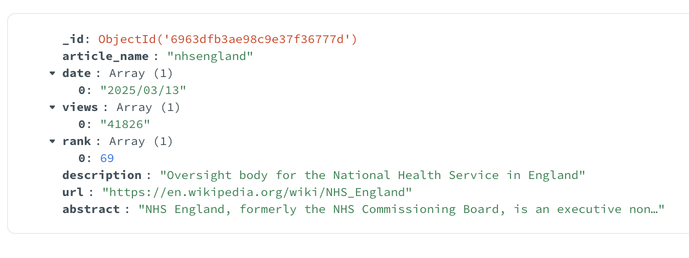
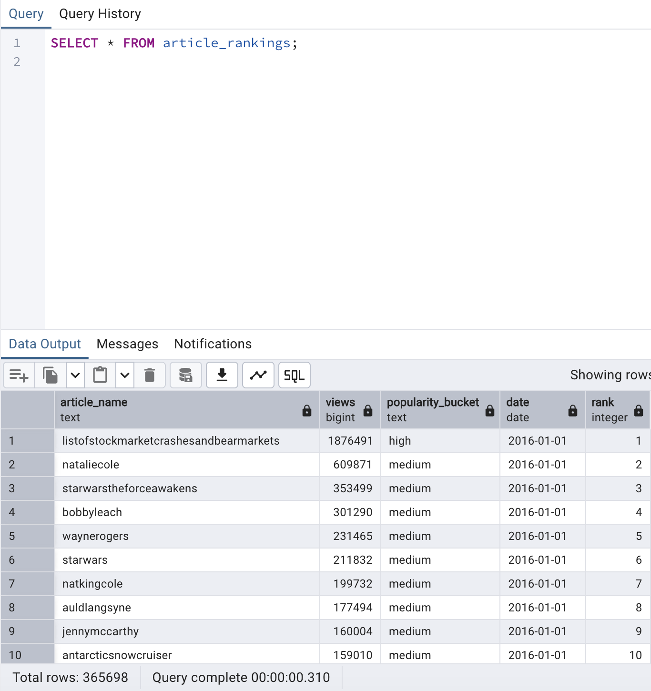

# TextETLPipeline
End-to-end ETL pipeline for large scale linguistic, text data using PySpark, MongoDB, PostgreSQL and FastAPI.

## Overview

**TextETLPipeline** is an end-to-end Data Engineering project that builds a scalable ETL pipeline over 
large scale Wikipedia data and exposes analytical insights through a FastAPI based REST API.

The project focuses on:
- Processing and cleaning large textual and time-series datasets using **PySpark**
- Storing data using both NoSQL and SQL based Databases (MongoDB + PostgreSQL)
- Designing analytical queries for understanding Wikipedia content popularity
- Exposing insights via **FastAPI** with interactive Swagger documentation

## Data

This project uses **two publicly available Kaggle datasets**, both derived from Wikipedia.

### 1. Wikipedia Pageviews Dataset
Source:  
https://www.kaggle.com/datasets/vladtasca/wikipedia-pageviews

This dataset tracks the **100 most popular Wikipedia articles by daily pageviews**, 
enabling analysis of trending and consistently popular topics on Wikipedia over time.

Fields include:
- `article` – Title of the Wikipedia article  
- `date` – Date of the pageview record  
- `views` – Number of pageviews across all platforms  
- `rank` – Rank of the article among the top 100 on that day  

### 2. Wikipedia Structured Contents Dataset (English)
Source:  
https://www.kaggle.com/datasets/wikimedia-foundation/wikipedia-structured-contents

This dataset provides **pre-parsed, structured representations of Wikipedia articles**, including both metadata and 
textual content. Only the **English Wikipedia (`enwiki_namespace_0`)** subset is used in this project.
Fields used in this project, include:
- `name` – Title of the article  
- `url` – Canonical Wikipedia URL  
- `abstract` – Lead section summarising the article  
- `description` – One-sentence summary of the article

## Tech Stack

- **Python 3** - Programming Language
- **Apache Spark / PySpark** – distributed data processing
- **MongoDB** – document-based storage for article data
- **PostgreSQL** – relational, table-based storage for analytical and time-series data
- **FastAPI** – REST API layer
- **Uvicorn** – ASGI server for FastAPI

## Why This Project Is Useful

- **Real-world analytics problem**  
  Understand what Wikipedia users actually read and how popularity changes over time.

- **Hands-on Spark experience**  
  Demonstrates ingestion, transformation, joins, aggregation, and deduplication using PySpark.

- **NoSQL and SQL persistence designs**  
  Uses MongoDB for document-style article data and PostgreSQL for analytical queries.

- **Practical API exposure**  
  Transforms batch-processed data into queryable analytics via REST APIs.

## Project Architecture

**`pipeline.py`** – Orchestrates the entire, end-to-end ETL workflow by coordinating extraction, 
transformation, and loading of data into MongoDB and PostgreSQL.
**`config.py`** – Has project configuration such as data paths and database 
connection details for MongoDB and PostgreSQL.  
**`pipeline_test.ipynb`** – Used for interactive experimentation, validation, and debugging 
of individual pipeline steps during development.

### 1. Extract Phase (`src/extract.py`)
- Ingests large CSV and JSONL files using PySpark
- Supports single files and directories

### 2. Transform Phase (`src/transform.py`)
- Cleans and standardises article names
- Removes invalid and corrupt records
- Deduplicates article metadata
- Joins pageviews with article metadata
- Creates analytical features such as:
  - popularity buckets
  - aggregated statistics per article

### 3. Load Phase (`src/load_mongo.py` and `src/load_postgresql.py`)

#### i) MongoDB (Database: `text_etl_pipeline`, Collection: `articles_data`)
- **PyMongo** is used as the official Python driver for MongoDB and the 
Database and the collection is created automatically.
- Stores **one document per Wikipedia article**
- Indexed on `article_name` for fast lookups
- Each document includes:
  - Ordered lists of `views`, `dates`, and `ranks`
  - Article text data such as `abstract`, `description`, and `url`
  

Image 1 - Sample document from MongoDB *articles_data* collection

#### ii) PostgreSQL 

PostgreSQL is used for **structured, relational data and analytical queries**.  
**Psycopg2** is used as the PostgreSQL adapter for Python which creates the database and tables automatically.
The project maintains two tables:

1. **`pageviews_rankings`**
   - Cleaned, standardised pageview time-series data
   - One row per article per date
   - Fields include `article_name`, `date`, `views`, `popularity_bucket` and `rank`

Image 2 - A snapshot of the *article_rankings* table

2. **`pageviews_analytics`**
   - Aggregated analytics computed per article
   - Includes metrics such as:
     - `avg_views`
     - `max_views`
     - `best_rank`
     - `total_days_tracked`

Image 3 - A snapshot of the *article_analytics* table

### 4.  FastAPI Layer (`API/app.py`)

The project exposes analytical insights and article data via **FastAPI** APIs.

### Available Endpoints

| Endpoint | Description |
|--------|------------|
| `/analytics/top-article/day` | Most popular article on a given day |
| `/analytics/top-article/month` | Most popular article in a given month |
| `/analytics/top-article/year` | Most popular article in a given year |
| `/articles/{article_name}` | Full article data from MongoDB |
| `/analytics/article/{article_name}` | Key analytics metrics for an article |

## How to Run the Project

1. Install all prerequisites mentioned in the **Tech Stack** section.

2. Download the respective datasets from the links provided in the **Data** section above.

3. Update all the variables in `config.py` accordingly. 

4. Run the ETL pipeline to process and load the data, `python pipeline.py`.

5. Verify that data has been loaded successfully.  
Optionally, You can use MongoDB Compass for  
MongoDB and pgAdmin4 for PostgreSQL inspection respectively.

6. Start the FastAPI server on localhost using, `uvicorn API.app:app` command in the terminal.
   
7. Optionally, Open Swagger UI to explore and test the available API endpoints using the `http://127.0.0.1:8000/docs` endpoint.
